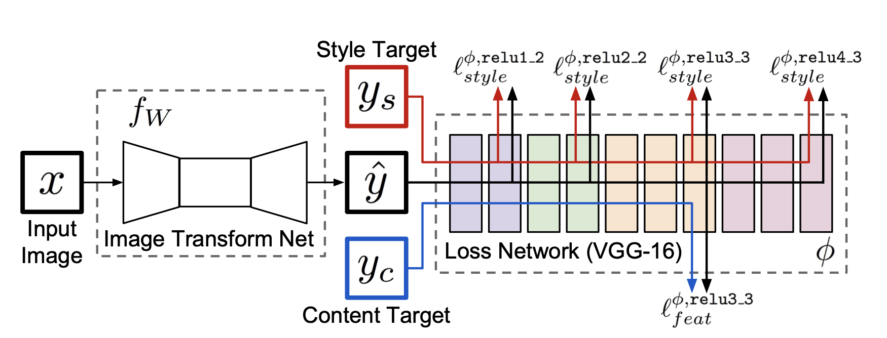
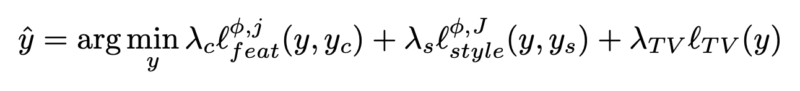

# Image-Style-Transfer-Pytorch-Implementation

## Description

This is based on the thesis Perceptual losses for real-time style transfer and super-resolution. In European conference on computer vision. I will be transferring the style of vincent van goh's famous painting the stary night into my own images. 
The network architecture is shown below. 

In the image transformation networks, only strided and fractionally strided convolutions are used for downsampling and upsampling without any pool- ing layers. It has five residual blocks, with each conv layers followed by batch normalization and ReLU nonlinearities except for the last layer. All convolutional layers use 3x3 kernels except for the first and last layers which applies 9x9 kernels. The input and output are set as 3x256x256 in the style transfer, and 3x288x288 in super-resolution

Perceptual loss functions are defined as the functions that measure high- level perceptual and semantic differences between images. They utilize the loss network phi which are pretrained for image classification. This phi in this experiment is based on the 16-layer VGG network pretrained on the ImageNet dataset. The final loss function is shown below. 

